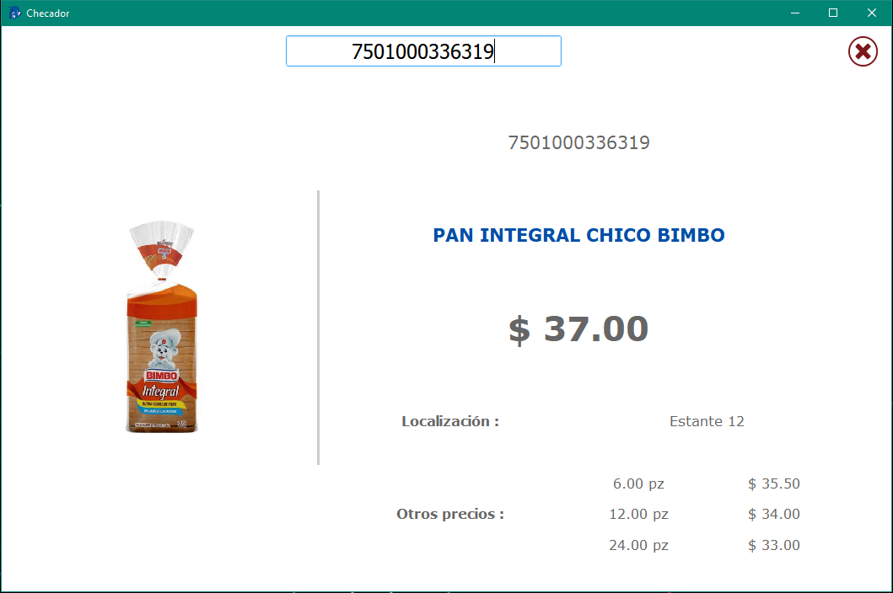

# PriceChecker

PriceChecker es una aplicación desarrollada en Qt 5.15.2 que funciona como un checador de precios para negocios que utilizan SICAR Punto de Venta. La aplicación permite mostrar la existencia, imagen, localización y hasta tres precios de mayoreo de los productos disponibles. Este proyecto puede servir como base para suplir carencias del checador de productos de SICAR.

## Requisitos

- Qt 5.15.2
- MySQL
- MinGW 8.1.0
- Impresora térmica de 80 mm

## Instalación

1. Clona este repositorio en tu máquina local.
2. Realiza la instalación de Qt 5.15.2 y MySQL en tu sistema.
3. Compila el proyecto abriendo el archivo `.pro` y ejecutándolo.
4. Si no deseas compilar desde el código fuente, ejecuta `windeployqt` en el archivo `PriceChecker.exe` ubicado en la ruta `doc/bin/` del repositorio.
5. Instala MinGW 8.1.0 en tu sistema.
6. Instala el setup `VC_redist` ubicado en la carpeta `doc/install_req/`.
7. Modifica el archivo `ip_server.txt` para configurar la IP del servidor donde se encuentra la base de datos de SICAR. Además, asegúrate de ingresar el usuario y la contraseña de SQL con permisos de consulta.

## Uso

Una vez instalado y configurado, ejecuta `PriceChecker.exe` para abrir la aplicación.

## Contribuciones

Las contribuciones son bienvenidas. Si deseas mejorar o agregar características a PriceChecker, siéntete libre de hacer un fork del repositorio y enviar un pull request con tus cambios.

## Licencia

Este proyecto está bajo la Licencia MIT.
